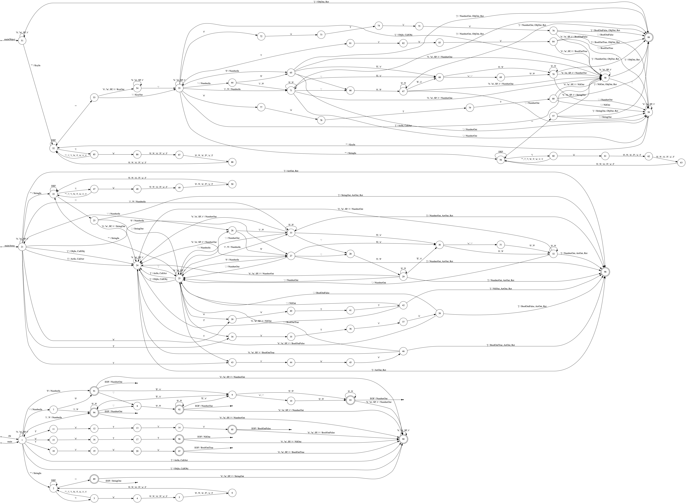

# TinyJSON

TinyJSON is a codegen for JSONMarshal & JSONUnmarshal methods. It uses `go/ast`
to parse structs in packages, so any code won't run inside repo.
It targets to support `tinygo` and avoid interfaces and reflect calls to aim
the best speed and tiny size.
Lexer is built using `ragel`, which produces pushdown automaton.
Theoretically it is the fastest possible lexer for json.

## Development stage

It is in alpha. Almost everything works. Interfaces not supported yet. Feel free to file issue.

## How to use it
```bash
go get github.com/tinyjson/tinyjson
go install github.com/tinyjson/tinyjson
```

add this comment somewhere in library
```go
//go:generate tinyjson $GOFILE
```

and this before each structure you want to have JSONMarshal & JSONUnmarshal methods.
```go
//tinyjson:json
```

Warning: the comment above is only visible inside batch structure declaration. (TODO: fix)

Then run `go generate` in package dir.

## Dependency

The goal is to depend only on `bytes, strconv` and tiny repo `lexer` with `errors, strconv` dependency.
```
	"bytes"
	"strconv"

	"github.com/tinyjson/lexer"
```

## What is working?

All most everything is working. Interfaces not supported yet. Pointers could not work sometimes (e.g. pointers on pointers and so on).

## What TODO?

 - Add support for all kind of pointers.
 - Add support for optional marshal and unmarshal methods building.
 - Add sting constant optimisation for marshalers.
 - Add optional support for interfaces.
 
## What is inside lexer?

